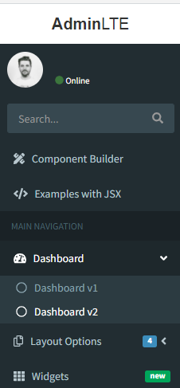
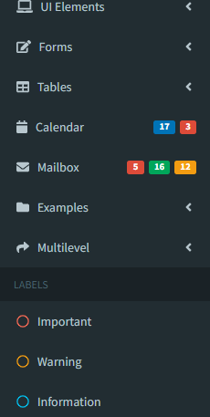
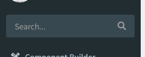
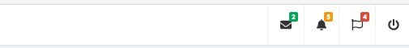
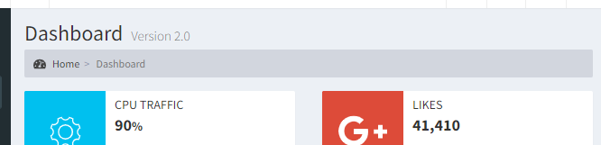
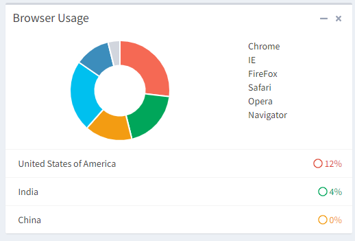
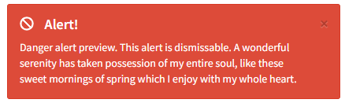
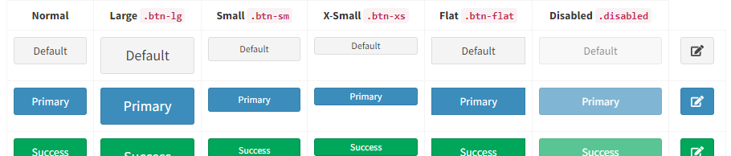

# adminlte-react
Yet another project based on the great [AdminLTE](https://adminlte.io/) Control Panel Template. This is not because of a not invented here syndrom but because the other projects seem not very active or did not meet the expectations I had in using such a react component. The philosophy for this project was to make it as easy as possible to use from a developer standpoint and rework it where I've seen the use to. Currently it does still depend on jQuery here and there (especially the DataTables Component).

Samples can be found under <a href="https://react.sper.at" ref="noopender noreferrer">react.sper.at</a> and sourcecode on <a href="https://github.com/sd1337/adminlte-2-react-examples" ref="noopender noreferrer">github</a>

## Installation

`npm i adminlte-2-react`

## Hello-World

Easiest to achieve with `create-react-app`. Create a new project using `cra` and install `adminlte-2-react`.
Copy this to App.js created by `create-react-app` 
```
import React, { Component } from 'react';
import AdminLTE, { Sidebar, Content, Row, Col, Box, Button } from 'adminlte-2-react';

const { Item } = Sidebar;

class HelloWorld extends Component {
  state = {}

  render() {
    return (<Content title="Hello World" subTitle="Getting started with adminlte-2-react" browserTitle="Hello World">
      <Row>
        <Col xs={6}>
          <Box title="My first box" type="primary" closable collapsable footer={<Button type="danger" text="Danger Button" />}>
            Hello World
          </Box>
        </Col>
        <Col xs={6}>
          <Box title="Another box">
            Content goes here
          </Box>
        </Col>
      </Row>
    </Content>);
  }
}

class App extends Component {

  sidebar = [
    <Item key="hello" text="Hello" to="/hello-world" />
  ]

  render() {
    return (
      <AdminLTE title={["Hello", "World"]} titleShort={["He", "we"]} theme="blue" sidebar={this.sidebar}>
        <HelloWorld path="/hello-world" />
      </AdminLTE>
    );
  }
}

export default App;

```


## Components


* [Box](#Box)

### General UI Type/Coloring options
Several components have a property `type` or `color` that allows the usage of the following values to give different accents to the component

### Types and Colors

| Type | Color | ColorCode |
| ---- | ----- | --------- |
| `default` | `gray` | `#d2d6de` |
| `primary` | `light-blue` | `#3c8dbc` |
| `info` | `aqua` | `#00c0ef` |
| `success` | `green` | `#00a65a` |
| `warning` | `yellow` | `#f39c12` |
| `danger` | `red` | `#f56954` |
| `error` | `red` | `#dd4b39` |

### Additional Colors

In addition there are several colors available without a corresponding type
| Color |
| ----- |
| `navy` | 
| `teal` | 
| `purple` | 
| `orange` | 
| `maroon` | 
| `black` | 

### Icons

AdminLTE makes use of font-awesome icons and ionicons. Since we wanted to stay up to date, we migrated font awesome to version 5.x. Therefore the syntax for icons is no longer `fa-icon` but instead `far/fas/fab-icon`. All available icons can be found on the respective websites ([font-awesome](https://fontawesome.com/icons?d=gallery), [ionicons](https://ionicons.com/))


### AdminLTE

##### Props

| Name    | Type    | Default | Description |
| --------|---------|---------|-------------|
| children | node |  | NavbarMenu, Sidebar and Content Components belong here |
| title | oneOf: `string`, `[string]` | `['Admin', 'LTE']` | Title in header bar, if an array is supplied the first element will be rendered bold and the second normal |
| titleShort | oneOf: `string`, `[string]` | `['Admin', 'LTE']` | Title in header bar when the sidebar is collapsed, if an array is supplied the first element will be rendered bold and the second normal |
| theme | oneOf: `'black-light'`, `'black'`, `'blue'`, `'blue-light'`, `'green'`, `'green-light'`, `'purple'`, `'purple-light'`, `'red'`, `'red-light'`, `'yellow'`, `'yellow-light'` | `'blue'` | Colortheme for AdminLTE |
| browserTitle | string | Untitled | Browsertitle, can be set here globally or for each site indvidually |
| sidebar | arrayOf: `<Item />`, `<Header />`, `<li />`|  | Sidebar items |
| footer | oneOfType: `node`, [`node`] | `null` |  |
| searchbarFilter | `boolean` | `false` | Include searchbar in sidebar |
| homeTo | `string` | `'/'` | Homeroute when you click on App name in Sidebar |

### Sidebar
Note that all sidebar elements are not directly exported by `AdminLTE` instead you should import `Sidebar` and destructure the required elements.

```
import AdminLTE, { Sidebar } from 'adminlte-2-react';

const { Item, Header, UserPanel, Searchbar } = Sidebar;
...
```



##### Props
| Name    | Type    | Default | Description |
| --------|---------|---------|-------------|
| searchbarFilter | `boolean` | `false` |  |

#### Item

This component is used to render the sidebar entries. Multilevel entries can be achieved by simply passing furhter items as children.

##### Props

| Name    | Type    | Default | Description |
| --------|---------|---------|-------------|
| id | string |  |  |
| **text** | string |  | Display text of the item |
| children | `<Item />` |  | A nested `Item` will be displayed as a sublevel item and allows for multilevel menus |
| icon | [icon](#icons) | `'far-circle'` | Icon on the left side |
| to | string | `'#'` | Relative links should refere to anonther page components `path` property and absolute links are simple anchors |
| labels | arrayOf: `{small: boolean, color: string, text: string, type:string}`|  | Description for one or more labels |
| color | `string` |  | Iconcolor |
| isSubItem | `boolean` |  | True if its a nested sidebar item, will be set automatically |

#### Header

Header is used to seperate side bar items into multiple groups

##### Props

| Name    | Type    | Default | Description |
| --------|---------|---------|-------------|
| **text** | `string` |  | Display text of the item |

#### UserPanel

Include a user information in the sidebar


##### Props

| Name    | Type    | Default | Description |
| --------|---------|---------|-------------|
| **username** | `string` |  | Display the username |
| imageUrl | `string` |  | Show a image besides the name |
| link | `string` |  | Include a link to a detail page |
| status | `string` |  | Show the user status |
| statusType | [type](#types-and-colors) |  | Color the user status |

#### Searchbar

Provide a sitewide search bar inside the sidebar



##### Props

| Name    | Type    | Default | Description |
| --------|---------|---------|-------------|
| includeButton| `bool` |  | Show search icon/button |
| onButtonClick| `func` |  | On click action |
| onChange| `func` |  | On search change |
| placeholder| `string` |  | Searchfield placeholder |
| value| `string` |  |  |
| defaultValue| `string` |  |  |

### Navbar

It is possible to enhance the top navigation bar with clickable icons and dropdown menus to show additional interactions (e.g. notification bars)



##### Props
| Name    | Type    | Default | Description |
| --------|---------|---------|-------------|
| additionalMenus | `oneOfType` | `null` |  |
| children | `oneOfType` | `null` |  |

#### Core

To use the navbar menu you have to wrap `Entries` with the Core component

```
<Navbar.Core>
  <Entry
    icon="fas-envelope"
  >
    <MessageItem>
    ...
  </Entry>
</Navbar.Core>
```

#### Entry

An entry is the component rendered inside the navbar it can be either used as an additional button (e.g. for logout actions) or as an menu opener rendering components of type `MessageItem`, `NotificationItem`, `TaskItem`. Additionally an colored label can be attached indicating that several actions are behind the menu. If it should act as an button provide the onClick prop otherwise provide some children to use it as an menu.

| Name    | Type    | Default | Description |
| --------|---------|---------|-------------|
| icon | [icon](#icons) |  | Entry icon |
| labelType | [type](#types-and-colors) |  | Label accent |
| labelValue | `number` |  | Label value displayed on top right of entry. If you provide no value, the value is calculated as the number of nested children, to disable the label in this case provide a value of `0` |
| headerText | `string` |  | Text above menu items in opened state |
| footerText | `string` |  | Text bellow menu items in opened state |
| onFooterClick | `function` |  | Action triggered on footer click |
| className | `string` |  | Additional classes |
| children | oneOf: `NotificationItem`, `TaskItem`, `MessageItem` |  | Additional classes |
| onClick | `function` |  | On click action |

#### NotificationItem

A simple notification style navbar list item with icon

| Name    | Type    | Default | Description |
| --------|---------|---------|-------------|
| **icon** | [icon](#icons) |  | Icon left of text |
| **iconColor** | [color](#types-and-colors) |  | Icon color |
| **text** | `string` |  | Item text |
| to | `string` |  | React dom route |
| onClick | `function` |  | On click action |

#### TaskItem

Navbar item with progressbar

| Name    | Type    | Default | Description |
| --------|---------|---------|-------------|
| **value** | `number` |  | Progress value |
| **barColor** | [color](#types-and-colors) |  | Progressbar color |
| **text** | `string` |  | Item text |
| to | `string` |  | React dom route |
| onClick | `function` |  | On click action |
| min | `number` | `0` | Progress minimum value |
| max | `number` | `100` | Progress maximum value |

#### MessageItem

Instant message style notification

| Name    | Type    | Default | Description |
| --------|---------|---------|-------------|
| **text** | `string` |  | Item text |
| subText | `string` |  | Additional text |
| imageUrl | `string` |  | User image link |
| imageAlt | `string` |  | User image link |
| onClick | `function` |  | On click action |
| when | `momentObject` |  | Progress minimum value |
| whenFormats | `object` | `{ minutes: 'mins', hours: 'hours', today: 'today', yesterday: 'yesterday', days: 'DD.MM.YYYY', }` | Alternative namings for when annotation in item |


### Content

Main content container for normal and modal content



##### Props

| Name    | Type    | Default | Description |
| --------|---------|---------|-------------|
| title | `string` | `null` | Main title of the content window |
| subTitle | `string` | `null` | Subtitle of the content window |
| browserTitle | `string` | `null` | Browser tab title to display |
| homeRoute | `string` | `'/'` |  |
| modal | `boolean` | `false` | Toggle if content is modal or not |
| modalCloseTo | `string` | `null` | Redirect route after closing modal |
| show | `boolean` | `true` | Toggle show modal |
| modalFooter | `node` | `null` |  |
| children | `node` | `null` | Actual content |
| history | `history` | `null` | React router history |
| onHide | `function` | `null` | On modal hide callback |
| modalSize | `oneOf` | `null` |  |
| modalType | [type](#types-and-colors) | `null` |  |
| modalCloseButton | `boolean` | `true` | Show modal close button |

#### Box

Main box used to wrap most components.



##### Props

| Name    | Type    | Default | Description |
| --------|---------|---------|-------------|
| id | `string` |  |  |
| title | `string` |  | Boxtitle |
| collapsable | `boolean` | `false` | Toggles the possibility to minimize |
| closable | `boolean` | `false` | Toggles the possibility to close a box |
| header | `node` |  | Content to be rendered in the header position of the box |
| footer | `node` |  | Content to be rendered in the footer position of the box |
| type | [type](#types-and-colors) |  | Box accent |
| options | `node` |  | Icon with options placed next to the close, collapse icons |
| icon | [icon](#icons) |  | Boxicon |
| titleRight | `boolean` | `false` | Right align box title |
| loaded | `boolean` | `true` | Loading spinner for ajax content |
| noPadding | `boolean` | `false` | Removes box padding for tighter fitting |
| badge | [Badge](#badge), arrayOf: [Badge](#badge) |  | Badge(s) placed in header |
| toolIcon | [icon](#icons) | `wrench` | Custom icon for tools menu |
| customOptions | `node` |  | Options for tool menu in header |
| className | `string` |  |  |
| footerClass | `string` |  | custom `className` for the footer region |
| collapsed | `boolean` | `false` | Initial collapsed state |
| solid | `boolean` | `false` | Solid box styling option |
| textCenter | `boolean` | `false` | Centered text styling in body |
| padding | `boolean` | `false` | Additional body padding |
| bodyClassName | `string` |  | custom `className` for the body region |
| border | `boolean` | `false` | Visible border around box |
| style | `style` | null | Inline style info for the box |
| children | `node` |  | Box content rendered in body |

#### Col

react-bootstrap `Col` component

#### Row

react-bootstrap `Row` component

#### Alert



##### Props

| Name    | Type    | Default | Description |
| --------|---------|---------|-------------|
| id | `string` |  |  |
| closable | `boolean` | `false` | Make alert closable |
| type | [type](#types-and-colors) |  | Alert acent |
| icon | [icon](#icons) |  | Icon display left to text |
| title | `string` |  | Alert title |
| children | `node` |  | Alert content |
| onDismiss | `function` | `null` | Callback after closing alert |

#### Badge

##### Props

| Name    | Type    | Default | Description |
| --------|---------|---------|-------------|
| id | `string` |  |  |
| color | [color](#types-and-colors) |  | Badge color |
| text | `string` |  | Badge text |

#### Button

As mentioned in [`react-bootstrap`](https://react-bootstrap.github.io/components/buttons/), React does not render new elements on new lines thus buttons side by side will be rendered without margin, to counteract that you can wrap your `<Button/>`'s with `<ButtonGroup />`



##### Props

| Name    | Type    | Default | Description |
| --------|---------|---------|-------------|
| id | `string` |  | Button id |
| size | oneOf: `'xs'`, `'sm'`, `'md'`, `'lg'` |  | Button size |
| type | [type](#types-and-colors) | `default` | Button accent |
| block | `boolean` |  | Display as block |
| icon | [icon](#icons) |  | Button icon |
| color | [color](#types-and-colors) |  | Button color can be used instead of type |
| classes | `string` |  | Button additional button classes |
| flat | `boolean` | `false` | Flat button styling |
| text | `string` |  | Button text |
| pullRight | `boolean` | `false` | Pull button right |
| pullLeft | `boolean` | `false` | Pull button left |
| disabled | `boolean` | `false` | Disable button |
| margin | `boolean` | `false` | Additional margin around button |
| to | `string` | `false` | Button link, relative uri's should be valid router routes |
| app | `boolean` | `false` | App button styling |
| outline | `boolean` | `false` | Button outline styling |
| badge | [Badge](#badge), arrayOf: [Badge](#badge) |  | Badge placed in button |
| onClick | `function` |  | On click action |
| split | `boolean` | `false` | Split button and submenu |
| children | `node` |  | Button submenu entries |
| alignRight | `boolean` | `false` |  |
| name | `string` | `null` | Form name |
| value | `oneOfType` | `null` | Form value |
| className | `string` | `null` |  |

#### ButtonGroup

Wrap buttons with ButtonGroup to get them inline


##### Props

| Name    | Type    | Default | Description |
| --------|---------|---------|-------------|
| pullRight | `boolean` | `false` | Pull button group right |
| margin | `boolean` | `false` | Additional margin around button group |
| vertical | `boolean` | `false` | Vertical align button group |
| children | `<Button />` |  | Button rendered in group |

#### Calendar

**_Work in progress_**

jQuery full calendar component

##### Props

| Name    | Type    | Default | Description |
| --------|---------|---------|-------------|

#### Callout

##### Props

| Name    | Type    | Default | Description |
| --------|---------|---------|-------------|
| id | `string` |  |  |
| type | [type](#types-and-colors) |  | Callout accent |
| title | `string` |  | Callout title |
| children | `node` |  | Callout content |

#### Chatbox

Undocumented use at your own risk

##### Props
| Name    | Type    | Default | Description |
| --------|---------|---------|-------------|
| id | `string` | `undefined` |  |
| type | `oneOf` | `null` |  |
| async | `boolean` | `false` |  |
| loaded | `boolean` | `true` |  |
| collapsable | `boolean` | `false` |  |
| closable | `boolean` | `false` |  |
| iconClass | `string` | `null` |  |
| badgeColor | `oneOf` | `null` |  |
| contactsTitle | `string` | `'Contacts'` |  |
| noPadding | `boolean` | `false` |  |
| title | `string` | `null` |  |
| titleRight | `boolean` | `false` |  |

#### SimpleTable

Basic table component with not much functionality, provides onSelect callback to interact with selected rows

##### Props

| Name    | Type    | Default | Description |
| --------|---------|---------|-------------|
| data | `array` |  | Array of objects matching the column description |
| columns | `array` |  | Column descriptions, see [next table](#column-options) for reference |
| condensed | `bool` | `false` | Compact data layout |
| striped | `bool` | `false` | Alternate row coloring |
| noMargin | `bool` | `false` | Removes table margin |
| border | `bool` |  `false`| Show borders around cells |
| responsive | `bool` | `false` | Resize table of window resize |
| hover | `bool` | `false` | Highlight hovered rows |
| onSelect | `function` | `undefined` | On row select callback |

##### Column Options

| Name    | Type    | Default | Description |
| --------|---------|---------|-------------|
| title | `string` |  | Column title |
| data | `string` |  | Data property containing the data to be rendered in the column |
| width | `string` |  | Use this prop to give the column a fixed width |
| render | `function` |  | Custom render function for the column with arguments `(data, rowData, rowIndex)` |

#### DataTable

##### Props

| Name    | Type    | Default | Description |
| --------|---------|---------|-------------|
| id | `string` | `undefined` |  |
| options | `object` |  | Array of objects matching the column description |
| ajaxMap | `function` |  | Allows custom argument mapping for ajax based data source, equivalent to `on('preXhr.dt')` |
| ajaxResponseMap | `function` |  | Mapping function for data retrieved on ajax based data source, equivalent to `on('preXhr.dt')` |
| data | `array` |  | Array of objects matching the column description |
| columns | `array` |  | Column descriptions, see [next table](#column-options) for reference |
| setDataTableRef | `function` |  | Callback that gets passed the datatable api() ref |
| onSelect | `function` |  | Callback after row gets selected - arguments `(rowdata)` |
| onDeselect | `function` |  | Callback after row deselect - arguments `(rowdata)` |
| footer | `boolean` | `false` | Renders column headers on bottom of table |
| hover | `boolean` | `false` | Highlight hovered rows |
| border | `boolean` | `false` | Show borders around cells |
| condensed | `boolean` | `false` | Compact data layout |
| striped | `boolean` | `false` | Alternate row coloring |
| noMargin | `boolean` | `false` | Removes table margin |
| responsive | `boolean` | `false` | Resize table of window resize |
| selectedRows | `[object]` |  | Allows passing in the currently selected rows |
| onClickEvents | `object` |  | Row level bound click events based on `class` on cell dom element. Example `render: (data) => ``<div class="on-click-event">${data}</div>``'` will bind to an object `{onClickEvent: (data, rowIndex, rowData) => {console.log("do stuff with row data")}}` |
| page | `number` |  | Active page, can be left empty if uncontrolled |
| totalElements | `func` |  | Passing this property or hasMore makes this component controlled, therefore pageSize, pageChange and orderChange props should be provided too |
| pageSize | `number` |  | Allows passing in the currently selected rows |
| onPageChange | `func` |  | Page change event handler |
| onOrderChange | `func` |  | Order change event handler |
| hasMore | `bool` |  | If you control data externally and are not exactly aware if additional pages exist you can provide hasMore instead to indicate if more data exists |
| order | `[object]` |  | Allows passing in the currently selected rows |
| searchValue | `string` | | Search value for datatable search field |
| onSearchChange | `function` | | Search value change event |

#### SmartTable

This will soon be replace Datatables as it Datatables is a jQuery widget and therefore breaks the entire React dom handling. SmartTable has a lot of auto configuration in it. It has a build in sort, filter and column selection functionality.

##### Props
| Name    | Type    | Default | Description |
| --------|---------|---------|-------------|
| data | `arrayOf` | `null` |  |
| columns | `array` |  | Column descriptions, see [column options](#column-options) for reference, if this prop is not provided smart table will infer them from the first entry in data as soon as data is supplied |
| condensed | `boolean` | `false` |  |
| responsive | `boolean` | `false` |  |
| page | `number` | `undefined` |  |
| striped | `boolean` | `false` |  |
| onPageChange | `function` | `undefined` |  |
| onSearch | `function` | `undefined` |  |
| border | `boolean` | `false` |  |
| filterExternal | `boolean` | `false` |  |
| pageSize | `number` | `20` |  |
| hover | `boolean` | `false` |  |
| noMargin | `boolean` | `false` |  |
| onOrderChange | `function` | `undefined` |  |
| onRowSelect | `function` | `undefined` |  |
| onSearchChange | `function` | `undefined` |  |
| defaultFilterColumn | `string` | `'$all'` |  |
| totalElements | `number` | `undefined` |  |
| hasMore | `boolean` | `undefined` |  |

##### Order props

| Name    | Type    | Default | Description |
| --------|---------|---------|-------------|
| title | `string` |  | Column title |
| data | `string` |  | Data property containing the data to be rendered in the column |
| width | `string` |  | Use this prop to give the column a fixed width |
| render | `function` |  | Custom render function for the column with arguments `(data, rowData, rowIndex)` |
| toggleHidden | `bool` |  | (SmartTable only) Disables option to show/hide column |
| toggleOrder | `bool` |  | | toggleHidden | `bool` |  | (SmartTable only) Disables option to sort |


#### Description

Simple wrapper over `<dl>`

##### Props

| Name    | Type    | Default | Description |
| --------|---------|---------|-------------|
| id | `string` |  |  |
| horizontal | `bool` | `false` | Will render the list horizontal |
| children | oneOfType: `node`, [`node`] | `` |  |

#### DescriptionItem

##### Props

| Name    | Type    | Default | Description |
| --------|---------|---------|-------------|
| text | `string` |  |  |
| label | `string` |  |  |
| noText | `bool` | false | Use this if you only want to render a label |

#### DescriptionBlock

A block content element containing several text elements (`text` and `header`) a percentage description and indicator.

##### Props

| Name    | Type    | Default | Description |
| --------|---------|---------|-------------|
| id | `string` |  |  |
| **percentage** | `number` |  |  |
| **percentageColor** | [color](#types-and-colors) |  |  |
| **header** | `string` |  |  |
| **text** | `string` |  |  |
| **indication** | oneOf: `left`, `right`, `up`, `down` |  |  |

#### Divider

Include a divider to give a better distinction between sidebar entries 

#### Infobox

Infobox with icon, text and optional progress information

##### Props

| Name    | Type    | Default | Description |
| --------|---------|---------|-------------|
| id | `string` |  |  |
| **icon** | [icon](#icons) |  |  |
| text | `string` |  |  |
| number | `string` |  | Bold text displayed in center, usually a number |
| color | [color](#types-and-colors) |  |  |
| progress | `number` |  |  |
| progressText | `string` |  |  |
| iconColorOnly | `string` |  | Alternate styling that colors only the icon instead of the entire box |

#### Infobox2

An alternative info box with similar props but other styling

##### Props

| Name    | Type    | Default | Description |
| --------|---------|---------|-------------|
| id | `string` |  |  |
| **icon** | [icon](#icons) |  |  |
| color | [color](#types-and-colors) |  |  |
| title | `string` |  |  |
| subTitle | `string` |  |  |
| text | `string` |  |  |
| footerText | `string` |  |  |
| footerIcon | [icon](#icons) | `fas-arrow-alt-circle-right` |  |
| onFooterClick | `function` |  | Callback on footer click |
| to | `route` |  | Can be used instead of onFooterClick to route instead to another page directly |

#### Label

##### Props

| Name    | Type    | Default | Description |
| --------|---------|---------|-------------|
| pullRight | `boolean` | `false` |  |
| children | `oneOfType` | `null` |  |
| type | `oneOf` | `null` |  |
| name | `string` | `uuidv4()` |  |
| labelSm | `number` | `2` |  |
| xs | `number` | `null` |  |
| label | `oneOfType` | `null` |  |
| labelLg | `number` | `null` |  |
| sm | `number` | `10` |  |
| labelMd | `number` | `null` |  |
| labelIcon | `string` | `null` |  |
| id | `string` | `undefined` |  |
| lg | `number` | `null` |  |
| md | `number` | `null` |  |
| labelXs | `number` | `null` |  |
| labelClass | `string` | `null` |  |
| labelPosition | `oneOf` | `'left'` |  |

#### LoadingSpinner

##### Props

| Name    | Type    | Default | Description |
| --------|---------|---------|-------------|
| icon | `string` | `'fas-sync-alt'` |  |
| size | `string` | `'3x'` |  |

#### LoginCore

##### Props

| Name    | Type    | Default | Description |
| --------|---------|---------|-------------|
| children | `oneOfType` | `null` |  |

#### Margin

##### Props

| Name    | Type    | Default | Description |
| --------|---------|---------|-------------|
| pullRight | `boolean` | `false` |  |
| children | `oneOfType` | `` |  |

##### Props

| Name    | Type    | Default | Description |
| --------|---------|---------|-------------|

#### Memberbox

##### Props

| Name    | Type    | Default | Description |
| --------|---------|---------|-------------|
| viewAllLink | `string` | `'/'` |  |
| id | `string` | `undefined` |  |
| type | `oneOf` | `` |  |
| collapsable | `boolean` | `false` |  |
| async | `boolean` | `false` |  |
| closable | `boolean` | `false` |  |
| title | `string` | `null` |  |

#### NavList

##### Props

| Name    | Type    | Default | Description |
| --------|---------|---------|-------------|
| pills | `boolean` | `false` |  |
| stacked | `boolean` | `false` |  |
| children | `oneOfType` | `` |  |

#### NavListItem

##### Props

| Name    | Type    | Default | Description |
| --------|---------|---------|-------------|
| text | `string` | `null` |  |
| color | `oneOf` | `'red'` |  |
| to | `string` | `null` |  |
| icon | `string` | `'far-circle'` |  |
| onClick | `function` | `null` |  |
| iconLabel | `string` | `null` |  |

#### Pagination

##### Props

| Name    | Type    | Default | Description |
| --------|---------|---------|-------------|
| hasMore | `boolean` | `null` |  |
| activePage | `number` | `null` |  |
| pageSize | `number` | `null` |  |
| onChange | `function` | `` |  |
| totalElements | `number` | `null` |  |
| labels | `shape` | `{` |  |

#### ProductList

##### Props

| Name    | Type    | Default | Description |
| --------|---------|---------|-------------|
| children | `oneOfType` | `` |  |
| inBox | `boolean` | `false` |  |

#### ProductListItem

##### Props

| Name    | Type    | Default | Description |
| --------|---------|---------|-------------|
| image | `string` | `null` |  |
| description | `string` | `null` |  |
| labelType | `oneOf` | `'info'` |  |
| label | `string` | `false` |  |
| title | `string` | `null` |  |
| to | `string` | `'/'` |  |

#### ProgressBar

##### Props

| Name    | Type    | Default | Description |
| --------|---------|---------|-------------|
| xs | `boolean` | `false` |  |
| type | `oneOf` | `'primary'` |  |
| color | `oneOf` | `null` |  |
| active | `boolean` | `false` |  |
| xxs | `boolean` | `false` |  |
| text | `string` | `null` |  |
| value | `number` | `` |  |
| sm | `boolean` | `false` |  |
| vertical | `boolean` | `false` |  |
| striped | `boolean` | `false` |  |
| max | `number` | `100` |  |
| min | `number` | `0` |  |

#### ProgressGroup

##### Props

| Name    | Type    | Default | Description |
| --------|---------|---------|-------------|
| color | `oneOf` | `` |  |
| currentValue | `number` | `` |  |
| maxValue | `number` | `` |  |
| text | `string` | `null` |  |

#### Sparkbar

##### Props

| Name    | Type    | Default | Description |
| --------|---------|---------|-------------|
| color | `string` | `` |  |
| data | `arrayOf` | `` |  |
| height | `oneOfType` | `` |  |
| padding | `boolean` | `false` |  |

#### SparklineBox

#### Tabs

Wrapper around react-bootstrap tabs, this can be either used as uncontrolled tabs by providing a `defaultActiveKey` property or a controlled tabs using `activeKey` and `onSelect` props

##### Props

| Name    | Type    | Default | Description |
| --------|---------|---------|-------------|
| id | `string` |  |  |
| activeKey | `string` |  | Currently active tab, if you provide an activeKey you should also provide an `onSelect` event handler prop |
| defaultActiveKey | `string` |  | Initially active tab, similar to react behaviour of `defaultValue` on `<input>` components this prop provides an inital state for uncontrolled tabs |
| onChange | `function` |  | Event handler fired when a tab is changed |
| children | `TabContent` |  | Provide multiple `TabContent` as child to render anything in tabs |
| pullRight | `bool` | `false` | Pulls the tab header to the right side |
| contentHeight | `string` |  | If the content height varies you can provide a fixed height to prevent moving elements when changing between tabs |
| mountOnEnter | `false` |  | Adds the tab content to react's virtual dom at the first them it is selected |
| unmountOnExit | `false` |  | Removes inactive tabs from react virtual dom |
| icon | [icon](#icons) |  | Header icon besides the title |
| title | `string` |  |  |
| titleLeft | `bool` | false | Pulls the title to the left side when using the `pullRight` property |
| onSelect | `function` | `null` | Callback on changing tab |

#### TabContent

Use TabContent in conjuction with `Tabs` to actually provide the tabular content

##### Props

| Name    | Type    | Default | Description |
| --------|---------|---------|-------------|
| eventKey | `string` |  | Unique key used by `Tabs` to identify the currently active tab |
| children | `node` |  | Tabular content |

### Forms

A various of different form elements, ranging from simple default html forms (`Text`, `Radio`, `Select`, `Checkbox`) to advanced components based on jQuery Widgets like `Select2`, `ICheck` used by the original adminlte template and pure react based inputs like `Date`, `DateRange` (based on react-dates), `Slider` (based on rc-slider) and other components. All form components should behave like original react inputs with `defaultValue`'s and `onChange` passing more or less pure Javascript `event` objects to make it possible to work with libraries like `Formik`.
Note that all form elements are not directly exported by `AdminLTE` instead you should import `Inputs` and destructure the required elements.

```
import AdminLTE, { Inputs } from 'adminlte-2-react';

const { Select2, Date, DateTime, Text } = Inputs;
...
```


All form elements are wrap in the Component `InputWrapper` with various styling options such as icons, radio buttons, therefore all following props are shared between all form elements. If you want to add an additional element you can also wrap it with `InputWrapper` to fit it smooth into the styling of all other elements. Additional all inputs share the same labeling props to keep a similar styling.


### The following InputWrapper and Label props are shared within all of `adminlte-2-react` input components

##### InputWrapper Props

| Name    | Type    | Default | Description |
| --------|---------|---------|-------------|
| iconLeft | [icon](#icons) |  | Icon left of element |
| iconRight | [icon](#icons) |  | Icon right of element |
| addonLeft | `string`, `node` |  | Any content left of element |
| addonRight | `string`, `node` |  | Any content right of element |
| size | oneOf: `'xs'`, `'sm'`, `'md'`, `'lg'`  |  | Inputform size |
| checkboxLeft | `bool` |  | Checkbox left of element |
| checkboxLeftProps | `object` |  | Props for checkbox left of element |
| checkboxRight | `bool` |  | Checkbox right of element |
| checkboxRightProps | `object` |  | Props for checkbox right of element |
| radioLeft | `bool` |  | Radio left of element |
| radioLeftProps | `object` |  | Props for radio left of element |
| radioRight | `bool` |  | Radio right of element |
| radioRightProps | `object` |  | Props for radio right of element |
| buttonLeft | `node` |  | Button rendered left of element |
| buttonRight | `node` |  | Button rendered right of elemet |
| children | `node` |  |  |
| width | `string` |  | Fixed inputfield width |
| help | `string` |  | Help text bellow input element |

##### Label Props

| Name    | Type    | Default | Description |
| --------|---------|---------|-------------|
| label | `node` |  | Label for form element, can be a simple string or a more complex JSX component |
| labelIcon | [icon](#icons) |  | Icon next to label |
| labelPosition | oneOf: `above`, `left`, `none` | `left` |  |
| labelClass | `string` |  | Additional label classes, applied to form-group div (ex: used to add error for a filed) |
| type | [type](#types-and-colors) |  | Input element accent |
| name | `string` |  | Name property for screenreaders |
| labelXs | `number` (0-12) |  | Bootstrap label column width, does only work when labelPosition `left` is used |
| labelSm | `number` (0-12) |  | Bootstrap label column width, does only work when labelPosition `left` is used |
| labelMd | `number` (0-12) |  | Bootstrap label column width, does only work when labelPosition `left` is used |
| labelLg | `number` (0-12) |  | Bootstrap label column width, does only work when labelPosition `left` is used |
| xs | `number` (0-12) |  | Bootstrap input element column width, does only work when labelPosition `left` is used |
| sm | `number` (0-12) |  | Bootstrap input element column width, does only work when labelPosition `left` is used |
| md | `number` (0-12) |  | Bootstrap input element column width, does only work when labelPosition `left` is used |
| lg | `number` (0-12) |  | Bootstrap input element column width, does only work when labelPosition `left` is used |


#### Text

#### Slider

A slider component that can be used either as a single slider or a (multi) range slider, it is based on [rc-slider](https://github.com/react-component/slider). As with most other components, the most import props/usedful props are directly exposed. All other props can be passed to the wrapped component using the `rcSliderProps` property.

##### Props

| Name    | Type    | Default | Description |
| --------|---------|---------|-------------|
| color | [color](#types-and-colors) | 'light-blue' |  |
| defaultValue | `number` |  |  |
| value | `number` |  |  |
| onChange | `func` |  |  |
| tooltipRender | `func(value)` |  | Custom tooltip render function  |
| tooltipVisible | `oneOf: 'always', 'dragging', 'never'` |  | Custom tooltip render function  |
| handle | `element` |  | Pass a custom handle directly to rc-slider  |
| rcSliderProps | `object` |  | Pass any other rc-slider prop directly to rc-slider, see [documentation](https://github.com/react-component/slider)  |
| vertical | `boolean` | `false` | Display slider vertical |

#### Checkbox

Simple unstyled checkbox

##### Props

| Name    | Type    | Default | Description |
| --------|---------|---------|-------------|
| text | `string` |  | text next to checkbox |
| onChange | `func` |  |  |
| disabled | `bool` | `false` |  |
| name | `string` |  |  |
| value | `oneOf: string, number` |  | Value returned when box is checked |
| checked | `boolean` | `null` |  |

#### Radio

##### Props

| Name    | Type    | Default | Description |
| --------|---------|---------|-------------|
| onChange | `function` | `null` |  |
| name | `string` | `uuidv4()` |  |
| options | `arrayOf` | `` |  |

#### Select

##### Props

| Name    | Type    | Default | Description |
| --------|---------|---------|-------------|
| onChange | `function` | `null` |  |
| options | `` | `null` |  |
| label | `string` | `null` |  |
| disabled | `boolean` | `false` |  |
| value | `oneOfType` | `undefined` |  |
| name | `string` | `uuidv4()` |  |
| multiple | `boolean` | `false` |  |

#### Select2

This component is based on the popular jQuery select2 plugin. It has some improvements and events and select options are adjusted to provide a uniformal coding experience instead of dealing with ever changing api's. Additionally it is possible to provide an externally controlled datasource using `onDataFetch` callback.

##### Props

| Name    | Type    | Default | Description |
| --------|---------|---------|-------------|
| id | `string` |  | Component id |
| select2Options | `object` |  | Provide additional select2 options for the jQuery widget, see the select2 [homepage](https://select2.org) for the entire documention of those features |
| multiple | `bool` |  | Allow multiple value selection |
| options | `[object]` |  | All available options |
| value | `number, string, [number], [string]` |  | Selected values |
| defaultValue | `number, string, [number], [string]` |  | defaultValue selected values |
| disabled | `bool` | `false` |  |
| name | `string` |  | Name of `<input>` html field |
| allowClear | `bool` | `false` | Allow empty field value |
| onChange | `function` |  | On change event handler |
| onBeforeClose | `function` |  | On before option select handler |
| onClose | `function` |  | On after option select handler |
| onBeforeOpening | `function` |  | On before option select open handler |
| onOpen | `function` |  | On after option select open handler |
| onBeforeSelect | `function` |  | On before option selection handler |
| onSelect | `function` |  | On option selection handler |
| onBeforeUnselect | `function` |  | On before option deselect handler |
| onUnselect | `function` |  | On option deselect handler |
| onFetchData | `function({page, searchValue}, success(data), failure())` |  | On data fetch handler, arguments are an object with `page` no and `searchValue` current search term, a success callback that should be called with new data and a failure handler on fail |
| fetchDataDelay | `number` | 100 | Delay before onFetchData is being call when entering a search value, to prevent overfetching of data |

#### Date

This component in combination with `DateRange` is heavily based on [react-dates](https://github.com/airbnb/react-dates) with additional simplification and styling based on admin-lte. It should replace `bootstrap-datepicker` component in the original theme with a pure react alternative. The most common props are directly exposed on the `Date` component, additional props can be passed by using the `dateProps` property. The full documentation of available props can be found in [react-dates SingleDatePicker documentation](https://github.com/airbnb/react-dates#singledatepicker)

##### Props

| Name    | Type    | Default | Description |
| --------|---------|---------|-------------|
| id | `string` | `undefined` |  |
| type | [type](#types-and-colors) |  | Calendar accent |
| value | `string`, `moment object` |  | You can either pass in a string in combination with the `format` property or an already converted `moment.js` object, as the original this component used moment as its internal representation. Note that the onChange event will always return a `string` |
| defaultValue | `` | `undefined` |  |
| focused | `boolean` | `false` |  |
| format | `string` |  | Format string based on moment.js formatting rules |
| onChange | `function` |  | On change event handler |
| onFocusChange | `function` |  | On focus change event handler |
| name | `string` |  | Name that behaves like `<input>` name prop |
| placeholder | `string` |  |  |
| disabled | `bool` | `false` |  |
| required | `bool` | `false` |  |
| readOnly | `bool` | `false` |  |
| screenReaderInputMessage | `bool` | `false` |  |
| showClearDate | `bool` | `false` |  |
| customCloseIcon | `node` | |  |
| showDefaultInputIcon | `bool` | `false` |  |
| customInputIcon | `bool` | `false` |  |
| noBorder | `bool` | `false` |  |
| block | `bool` | `false` |  |
| small | `bool` | `false` |  |
| regular | `bool` | `false` |  |
| inputIconPosition | `string` |  |  |
| dateProps | `object` |  | Additional SingleDateProps that are not directly exposed, see [react-dates SingleDatePicker documentation](https://github.com/airbnb/react-dates#singledatepicker) |

#### DateRange

##### Props

| Name    | Type    | Default | Description |
| --------|---------|---------|-------------|
| endDateId | `string` | `` |  |
| onFocusChange | `function` | `null` |  |
| type | `oneOf` | `'default'` |  |
| startDateId | `string` | `` |  |
| endDate | `oneOfType` | `` |  |
| format | `string` | `undefined` |  |
| startDate | `oneOfType` | `` |  |
| dateRangeProps | `shape` | `null` |  |
| onStartChange | `function` | `` |  |
| onEndChange | `function` | `` |  |
| focused | `oneOf` | `null` |  |

#### DateTime

##### Props

| Name    | Type    | Default | Description |
| --------|---------|---------|-------------|
| dateTimeProps | `shape` | `undefined` |  |
| id | `string` | `undefined` |  |
| format | `string` | `true` |  |
| timeFormat | `string` | `'hh:mm'` |  |
| placeholder | `string` | `undefined` |  |
| disabled | `boolean` | `false` |  |
| value | `` | `undefined` |  |
| name | `string` | `undefined` |  |
| onChange | `function` | `undefined` |  |
| onBlur | `function` | `undefined` |  |
| defaultValue | `` | `undefined` |  |

#### ICheck

##### Props

| Name    | Type    | Default | Description |
| --------|---------|---------|-------------|
| options | `` | `['']` |  |
| disabled | `boolean` | `false` |  |
| value | `oneOfType` | `undefined` |  |
| name | `string` | `uuidv4()` |  |
| onChange | `function` | `null` |  |
| defaultValue | `oneOfType` | `undefined` |  |
